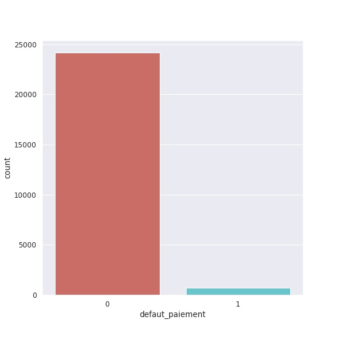
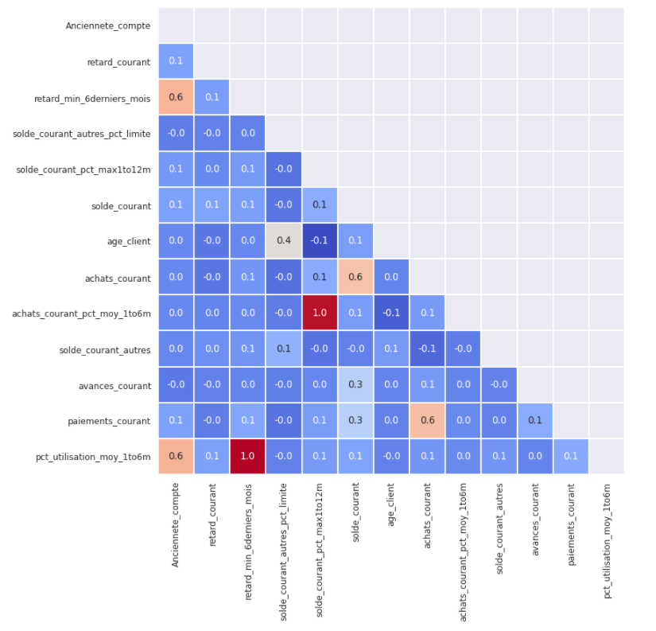
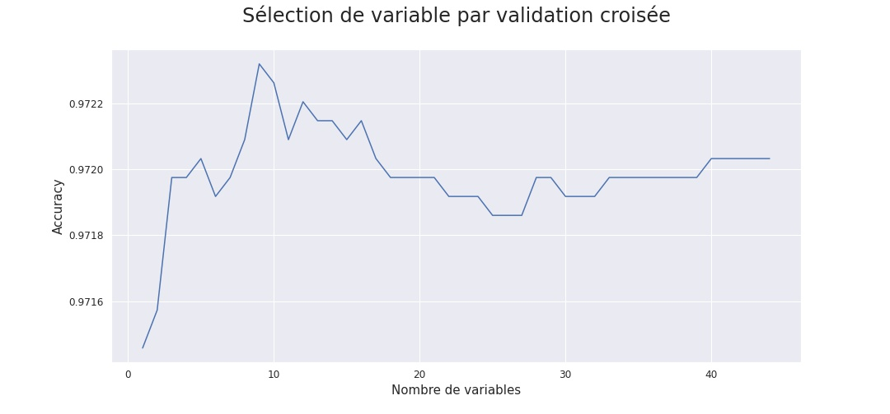

# Modélisation prédictive du défaut de paiement en gestion du risque de crédit

## Aperçu
Ce projet vise à développer un modèle de Credit Scoring pour prédire la probabilité qu'un détenteur de carte de crédit ne parvienne pas à payer son solde dû dans un horizon de 12 mois. Le modèle utilise des données historiques et actuelles sur le comportement des clients pour estimer le risque de défaut de paiement.

*Figure 1: Distribution de la variable défaut de paiement*

## Objectif
L'objectif principal est d'estimer la probabilité de défaut de paiement pour chaque client, permettant ainsi à l'institution financière de mieux gérer les risques associés aux cartes de crédit.

## Données utilisées
- 24877 observations (détenteurs de cartes)
- 33 variables (30 quantitatives, 3 qualitatives)
- Variables incluent : montants des achats, soldes, paiements, ratios d'utilisation, retards de paiement, informations sociodémographiques, etc.
- Horizon de prédiction : 12 mois après la date d'observation

## Méthodologie
1. Exploration et préparation des données
   - Analyse des variables qualitatives et quantitatives
   - Traitement des valeurs manquantes
   - Sélection de variables basée sur l'analyse de corrélation

2. Catégorisation des prédicteurs
   - Regroupement des modalités pour les variables qualitatives
   - Discrétisation des variables quantitatives

3. Modélisation
   - Utilisation de la régression logistique
   - Échantillonnage : 70% pour l'apprentissage, 30% pour le test
   - Estimation du modèle et sélection des variables finales

4. Évaluation du modèle
   - Mesure de la précision sur l'échantillon de test
   - Sélection finale des variables avec validation croisée (RFECV)

*Figure 2: Corrélation des variables sélectionnées*

## Résultats clés
- Précision du modèle sur les données de test : 97%
- 9 variables sélectionnées pour le modèle final
- Équation du modèle fournie pour le calcul du score et de la probabilité de défaut

*Figure 3: Sélection de variables par validation croisée*

## Conclusion
Le modèle développé montre une précision élevée et peut être utilisé pour prédire la probabilité de défaut de paiement pour de nouveaux clients. L'équation du modèle permet une intégration facile dans les systèmes de l'institution financière pour automatiser le calcul des scores de crédit.
